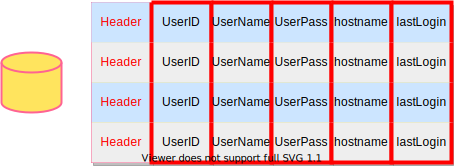

# Lecture #04: Database Storage (Part II)

## 1 Data Representation

The data in a tuple is essentially just byte arrays. It is up to the DBMS to know how to interpret those bytes to derive the values for attributes. A *data representation* scheme is how a DBMS stores the bytes for a value.

There are five high level datatypes that can be stored in tuples: integers, variable-precision numbers, fixedpoint precision numbers, variable length values, and dates/times.

### Integers

Most DBMSs store integers using their “native” C/C++ types as specified by the IEEE-754 standard. These values are fixed length.

Examples: `INTEGER`, `BIGINT`, `SMALLINT`, `TINYINT`.

### Variable Precision Numbers

These are inexact, variable-precision numeric types that use the “native” C/C++ types specified by IEEE-754 standard. These values are also fixed length.

Operations on variable-precision numbers are faster to compute than arbitrary precision numbers because the CPU can execute instructions on them directly. However, there may be rounding errors when performing computations due to the fact that some numbers cannot be represented precisely.

Examples: `FLOAT`, `REAL`.

### Fixed-Point Precision Numbers

These are numeric data types with arbitrary precision and scale. They are typically stored in exact, variablelength binary representation (almost like a string) with additional meta-data that will tell the system things like the length of the data and where the decimal should be.

These data types are used when rounding errors are unacceptable, but the DBMS pays a performance penalty to get this accuracy.

Examples: `NUMERIC`, `DECIMAL`.

### Variable-Length Data

These represent data types of arbitrary length. They are typically stored with a header that keeps track of the length of the string to make it easy to jump to the next value. It may also contain a checksum for the data.

Most DBMSs do not allow a tuple to exceed the size of a single page. The ones that do store the data on a special “overflow” page and have the tuple contain a reference to that page. These overflow pages can contain pointers to additional overflow pages until all the data can be stored.

Some systems will let you store these large values in an external file, and then the tuple will contain a pointer to that file. For example, if the database is storing photo information, the DBMS can store the photos in the external files rather than having them take up large amounts of space in the DBMS. One downside of this is that the DBMS cannot manipulate the contents of this file. Thus, there are no durability or transaction protections.

Examples: `VARCHAR`, `VARBINARY`, `TEXT`, `BLOB`.

### Dates and Times

Representations for date/time vary for different systems. Typically, these are represented as some unit time (micro/milli)seconds since the unix epoch.

Examples: `TIME`, `DATE`, `TIMESTAMP`.

### System Catalogs

In order for the DBMS to be able to deciphter the contents of tuples, it maintains an internal catalog to tell it meta-data about the databases. The meta-data will contain information about what tables and columns the databases have along with their types and the orderings of the values.

Most DBMSs store their catalog inside of themselves in the format that they use for their tables. They use special code to “bootstrap” these catalog tables.

## 2 Workloads

There are many different workloads for database systems. By workload, we are referring to the general nature of requests a system will have to handle. This course will focus on two types: Online Transaction Processing and Online Analytical Processing.

### OLTP: Online Transaction Processing

An OLTP workload is characterized by fast, short running operations, simple queries that operate on single entity at a time, and repetitive operations. An OLTP workload will typically handle more writes than reads.

An example of an OLTP workload is the Amazon storefront. Users can add things to their cart, they can make purchases, but the actions only affect their account.

### OLAP: Online Analytical Processing

An OLAP workload is characterized by long running, complex queries, reads on large portions of the database. In OLAP worklaods, the database system is analyzing and deriving new data from existing data collected on the OLTP side.

An example of an OLAP workload would be Amazon computing the five most bought items over a one month period for these geographical locations.

### HTAP: Hybrid Transaction + Analytical Processing

A new type of workload which has become popular recently is HTAP, which is like a combination which tries to do OLTP and OLAP together on the same database.

## Storage Models

There are different ways to store tuples in pages. We have assumed the n-ary storage model so far.

### N-Ary Storage Model (NSM)

In the n-ary storage model, the DBMS stores all of the attributes for a single tuple contiguously in a single page, so NSM is also known as a “row store.” This approach is ideal for OLTP workloads where requests are insert-heavy and transactions tend to operate only an individual entity. It is ideal because it takes only one fetch to be able to get all of the attributes for a single tuple.

**Advantage:**

- Fast inserts, updates, and deletes.
- Good for queries that need the entire tuple.

**Disadvantages:**

Not good for scanning large portions of the table and/or a subset of the attributes. This is because it pollutes the buffer pool by fetching data that is not needed for processing the query.

### Decomposition Storage Model (DSM)

In the decomposition storage model, the DBMS stores a single attribute (column) for all tuples contiguously in a block of data. Thus, it is also known as a “column store.” This model is ideal for OLAP workloads with many read-only queries that perform large scans over a subset of the table’s attributes.

**Advantages:**

- Reduces the amount of wasted work during query execution because the DBMS only reads the data that it needs for that query.
- Enables better compression because all of the values for the same attribute are stored contiguously.

**Disadvantages:**

- Slow for point queries, inserts, updates, and deletes because of tuple splitting/stitching.

To put the tuples back together when using a column store, there are two common approaches: The most commonly used approach is *fixed-length offsets*. Assuming the attributes are all fixed-length, the DBMS can compute the offset of the attribute for each tuple. Then when the system wants the attribute for a specific tuple, it knows how to jump to that spot in the file from the offest. To accommodate the variable-length fields, the system can either pad fields so that they are all the same length or use a dictionary that takes a fixed-size integer and maps the integer to the value.

A less common approach is to use *embedded tuple ids*. Here, for every attribute in the columns, the DBMS stores a tuple id (ex: a primary key) with it. The system then would also store a mapping to tell it how to jump to every attribute that has that id. Note that this method has a large storage overhead because it needs to store a tuple id for every attribute entry.

