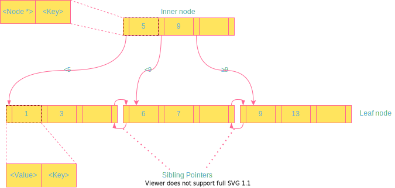

# Lecture 07: Tree Indexes I

## 1 Table Indexes

There are a number of different data structures one can use inside of a database system for purposes such as internal meta-data, core data storage, temporary data structures, or table indexes. For table indexes, which may involve queries with range scans.

<mark>A *table index* is a replica of a subset of a table’s columns that is organized and/or sorted for efficient access using a subset of those attributes.</mark> So instead of performing a sequential scan, the DBMS can lookup the table index’s auxiliary data structure to find tuples more quickly. The DBMS ensures that the contents of the tables and the indexes are always logically in sync.

There exists a trade-off between the number of indexes to create per database. Although more indexes makes looking up queries faster, indexes also use storage and require maintenance. It is the DBMS’s job to figure out the best indexes to use to execute queries.

## 2 B+Tree

<mark>A *B+Tree* is a self-balancing tree data structure that keeps data sorted and allows searches, sequential access, insertion, and deletions in *O(log(n))*.</mark> It is optimized for disk-oriented DBMS’s that read/write large blocks of data.

Almost every modern DBMS that supports order-preserving indexes uses a B+Tree. There is a specific data structure called a *B-Tree*, but people also use the term to generally refer to a class of data structures. The primary difference between the original *B-Tree* and the B+Tree is that *B-Trees* stores keys and values in all nodes, while B+ trees store values only in leaf nodes. Modern B+Tree implementations combine features from other *B-Tree* variants, such as the sibling pointers used in the Blink-Tree.

Formally, a B+Tree is an M-way search tree with the following properties:

- It is perfectly balanced (i.e., every leaf node is at the same depth).
- Every inner node other than the root is at least half full (M/2 − 1 <= num of keys <= M − 1).
- Every inner node with k keys has k+1 non-null children.

Every node in a B+Tree contains an array of key/value pairs. The keys in these pairs are derived from the attribute(s) that the index is based on. The values will differ based on whether a node is an inner node or a leaf node. For inner nodes, the value array will contain pointers to other nodes. Two approaches for leaf node values are record IDs and tuple data. Record IDs refer to a pointer to the location of the tuple. Leaf nodes that have tuple data store the the actual contents of the tuple in each node.

Arrays at every node are (almost) sorted by the keys.

> Visualization of B+ Tree operations including insert, delete and etc. [Click here to start!](https://www.cs.usfca.edu/~galles/visualization/BPlusTree.html)

### Insertion

To insert a new entry into a B+Tree, one must traverse down the tree and use the inner nodes to figure out which leaf node to insert the key into.

1. Find correct leaf *L*.
2. Add new entry into *L* in sorted order:
   - If *L* has enough space, the operation is done.
   - Otherwise split *L* into two nodes *L* and *L2*. Redistribute entries evenly and copy up middle key.  Insert index entry pointing to *L2* into parent of *L*.
3. To split an inner node, redistribute entries evenly, but push up the middle key.

### Deletion

Whereas in inserts we occasionally had to split leaves when the tree got too full, if a deletion causes a tree to be less than half-full, we must merge in order to re-balance the tree.

1. Find correct leaf *L*.
2. Remove the entry:
   - If *L* is at least half full, the operation is done.
   - Otherwise, you can try to redistribute, borrowing from sibling.
   - If redistribution fails, merge *L* and sibling.
3. If merge occurred, you must delete entry in parent pointing to *L*.

### Selection Conditions

Because B+Trees are in sorted order, look ups have fast traversal and also do not require the entire key. The DBMS can use a B+Tree index if the query provides any of the attributes of the search key. This differs from a hash index, which requires all attributes in the search key.

### Duplicate Keys

There are two approaches to duplicate keys in a B+Tree.

The first approach is to append record IDs as part of the key. Since each tuple’s record ID is unique, this will ensure that all the keys are identifiable.

The second approach is to allow leaf nodes to spill into overflow nodes that contain the duplicate keys. Although no redundant information is stored, this approach is more complex to maintain and modify.

### Clustered Indexes

The table is stored in the sort order specified by the primary key, can either be heap- or index-organized storage.

Some DBMSs always use a clustered index, they will automatically make a hidden row id primary key if a table doesn’t have an explicit one, but other DBMS cannot use them at all.

### Heap Clustering

Tuples are sorted in the heap’s pages using the order specified by a clustering index. DBMS can jump directly to the pages if clustering index’s attributes are used to access tuples.

### Index Scan Page Sorting

Since directly retrieving tuples from an unclustered index is inefficient, the DBMS can first figure out all the tuples that it needs and then sort them based on their page id.
