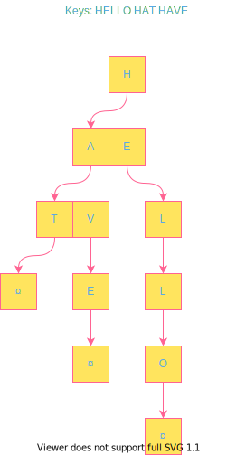
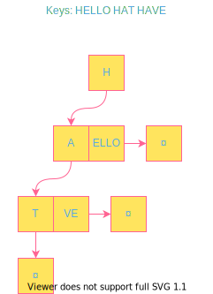

# Lecture 08: Tree Indexes II

# 1 Additional Index Usage

**隐式索引(Implicit Index)**：大多数DBMS都会自动建立索引来施加完整性限制(Integrity constraints)。比如基于主键或是或是unique限制建立索引，并基于此维护数据的完整性，如不能插入已经存在的主键等。值得注意的是，大多数DBMS不会建立基于外键的索引，因此需要手动在外键后加上`UNIQUE`修饰来主动建立索引。

> 完整性限制第一次出现在《DB Concepts 7th》的第13页，分为Domain Constraints和Referential Integrity。
>
> 后边比较详细的介绍在第四章，145页。

**部分索引(Partial Index)**：只给整个表的子集建立索引，建立出来的索引就叫部分索引。这样做可能可以减少维护所需开销。

```sql
CREATE INDEX idx_foo
ON foo (a, b)    --- 只取了foo中 a, b 两列
WHERE c = 'WuTang'; --- 限制了只建立关于'WuTang'的数据的索引
```

**覆盖索引(Covering Index)**：处理一次请求所需的所有属性（或者说数据、列）都在索引里，不需要额外IO访问叶节点的值对应的页。

```sql
CREATE INDEX idx_foo
ON foo (a, b);

SELECT b FROM foo --- b 在索引中
WHERE a = 123;    --- a 也在索引中
```

**含列索引(Index Include Columns)**：在建立时，希望额外添加几列到索引中，但不希望索引的键中包含这几列，这样的索引是含列索引。

```sql
CREATE INDEX idx_foo ON foo (a, b) INCLUDE (c);

SELECT b, c FROM foo WHERE a = 123;
```

**函数/表达式索引(Function/Expression Index)**：以表达式或函数的结果而非原值作为索引的键，这样的索引叫函数/表达式索引。

```sql
SELECT * FROM users WHERE EXTRACT(dow FROM login) = 2;

--- in order to boost up query like above, we need to build index
CREATE INDEX idx_user_login ON users (login); --- no one does this
CREATE INDEX idx_user_login ON users (EXTRACT(dow FROM login)); --- do this instead
--- dow means day of week, starting from monday as 1.
```

> 课上有个印度人问了个类似刻舟求剑的问题：如果函数或是表达式是可变的（即对于同一输入，输出可能不同，比如获得时间戳），那么在建立索引以后插入的数据，应该用建立索引时的状态还是要用插入数据时的状态？
>
> 对此，andy的回答模棱两可。最终通过在postgres试验得出结果：这个函数或表达式不能是可变的。`Function in index expression must be immutable.`

# 2 Trie Index

> Trie means retrieve tree.

字典树是一种把键用“位”（最小单元）表示，用来一点一点检查键的前缀，而不是一下子就查整个键的数据结构。如：



而基数树是字典树的变体，它将字典树纵向压缩，压缩的结果是基数树。如：



# 3 Inverted Indexes

转置索引存储着 *词 => 有这个词的记录* 的映射。在DBMS中，有时称之为全文搜索索引（full-text search index）。大多数DBMS都支持这个特性。

请求类别：

- 短语查询：查询有哪些记录包含给定的词，且按照给出词的顺序包含。
- 近似查询：查询有哪些记录包含两个词，且这两个词之间的距离在n个词以内。
- 通配查询：查询有哪些记录包含特定的词，这些词能与给出的模式（如正则）匹配。

设计选择：

- 存什么：索引至少要存储记录中的词，当然也可以存储额外信息，如词频，位置或者其它元数据。
- 何时更新：每次表更新时就更新转置索引开销会非常大且极其耗时。因此，大多DBMS会维护一个辅助数据结构，用以“暂存”更新，然后批处理更新。
