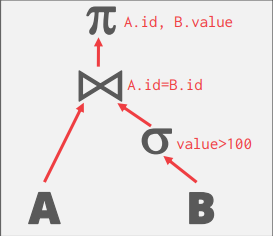
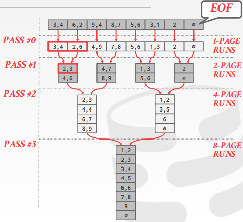

# Lecture 10: Sorting & Aggregation Algorithms
## Overview

### Course Status

整个数据库从底层到顶端总共分为：Disk Manager, Buffer Pool Manager, Access Methods (i.e. B+ Tree), Operator Execution 和 Query Planning. 这节课讲到 Operator Execution. 

### Query Plan

SQL 中的操作符在执行的时候可以被排成如下的一颗树，数据从底向顶流动，根节点的输出就是一次 Query 结果。

### Disk-oriented DBMS

由于这门课学的是 Disk-oriented DMBS，因此我们不能假设表能整个放进内存，同样也不能假设 Query 的结果能整个放进内存。

我们要使用 缓存池 来实现溢出到磁盘的算法。除此之外，我们应该要用能够最大化连续读写次数的算法。

### Today's Agenda

本节主要讲了 External Merge Sort 和 Aggregations.

## External Merge Sort

> 为什么要排序？表中的 Tuples 没有特定的顺序，但是 Query 常常想要以特定顺序取出它们。
>
> - `DISTINCT`：如果有顺序，去重的时候很方便。
> - 数据有序时，把它们从磁盘加载到 B+ 树会很快。
> - 聚合：`GROUP BY` 等。
>
> 如果数据能整个放进内存，那直接使用像快排这样的标准排序算法即可。但如果不能完整地放进内存，那就得用一些其他方法，且必须可以被度量由磁盘读写而带来的开销。

External Merge Sort 使用了是一个使用了分治的排序算法，它把数据分成许多 *run*，然后分别排序。总共有两个阶段：

- Sorting: 每次从磁盘中读取能放进内存的数据，排序，然后写回磁盘。
- Merging: 把上一阶段的结果组合起来，即有序的、较小的 *run* 组合成一个大的 *run*.

可以看到有些类似于 Merge Sort.

### 2 - Way External Merge Sort

> 假设缓冲池大小为 *B=3* 页，共有 *N* 页数据待排序。

- **Pass #0**：每次从磁盘上读取 *B* 页数据到内存，排序，然后写回磁盘。
- **Pass #1,2,3...**：递归地将 2 runs 合并成 1 个两倍于原先大小的 run.
- **Pass 的次数**：1 + ⌈ ㏒2N ⌉.
- **总的 I/O 次数**：2 × (# of passes)

### k-Way External Merge Sort

> 如果缓冲池大小为 *B>3* 页，共有 *N* 页数据待排序

- **Pass #0**：用 *B* 个缓冲页，产生了 ⌈ N / B ⌉ 个大小为 B 的 run，最后一个 run 可能没这么大。
- **Pass #1,2,3...**：递归地合并，每次合并 B - 1 个 run（B 页中有 1 页用来用来输出，所以一次只能合并 B - 1 个 run）
- **Pass 的次数**：1 +  ⌈ ㏒B-1 ⌈N / B⌉ ⌉
- **总共的 I/O 次数**：2N × (# of passes)

### Double Buffering Optimization(Prefetching)

在处理当前 *run* 的时候，其他线程可以预先把下一个要处理的 *run* 先加载进内存。这样可以持续的使用磁盘，进而有效地减少 IO 请求所需的等待时间。

### Using B+ Trees for Sorting

其实仔细想想 B+ 树的键也是有序的，如果需要排序的键刚好是某个已经有的 B+ 树索引的键，那不就不用排序了？但是我们还是需要考虑一个问题，关于这个键的 B+ 树是否是 Clustered B+ 树.

> 所谓 Clustered B+ 树，就是这个 B+ 树对应的数据在磁盘上的顺序与 B+ 树中这个键的顺序一致，否则就是 Unclustered B+ Tree。

如果是 Clustered B+ 树，则磁盘顺序与树中的顺序一致，可以连续读写，那非常好。但如果是 Unclustered B+ 树，那数据在磁盘上就不是顺序的了，这样的话在最坏情况下可能一个 tuple 一次 IO，这种情况就用外部排序。

## External Hashing Aggregate

> 把来自多个 tuple 的相同值压缩成一个 attribute。有两种方法来实现聚合：排序、哈希。排序就像上文提到的那样排就好。当然，如果数据能放进内存，那就直接快排即可。排序的好处自然是结果有序，但是如果并不要求结果有序，只要求 `DISTINCT` 呢（或是其他聚合，如 `SUM`，`AVG`）？这样好像没必要排序了，毕竟排序还是比较慢。这样我们就可以使用哈希。

以下假设我们能够使用 B 页 Buffer。外部哈希聚合也分为两个部分，Partition 和 ReHash：

- **Phase #1 Partition**：这个阶段用 B-1 页 Buffer 来分组，1 页 Buffer 来输入
  - 使用哈希函数 `h1` 对数据分组，某个 Buffer 写满了 ，就把 Buffer 写磁盘，腾出位置继续写。
  - 这样可以确保键相同的 tuple 肯定在一个组内。
- **Phase #2 - ReHash**：使用哈希函数 `h2` (`h2 != h1`) 在组内对键再次 hash，将当前组称为 partition
  - 由于不同键的 hash 值不一样，这确保不同键不会更新相同的 `RunningValue`
  - 遍历 partition 内的 tuple，更新对应的 `RunningValue`
  - 这里需要假设每一个 partition 的临时 hash 表能够放进内存
  - 完成一个 partition 的 ReHash，把聚合结果写到磁盘。这个 partition 的哈希表就可以扔了。

> 这里的 `RunningValue` 指的是为了计算出最终聚合的结果所需要维护的数据。比如，
>
> | `Aggregation` |  `RunningValue`  |
> | :-----------: | :--------------: |
> |     `AVG`     | (`COUNT`, `SUM`) |
> |    `COUNT`    |     `COUNT`      |
> |     `SUM`     |      `SUM`       |
> |     `MAX`     |      `MAX`       |
> |     `MIN`     |      `MIN`       |
