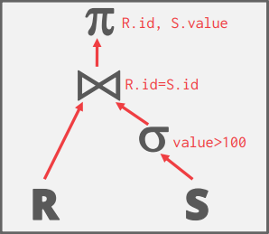
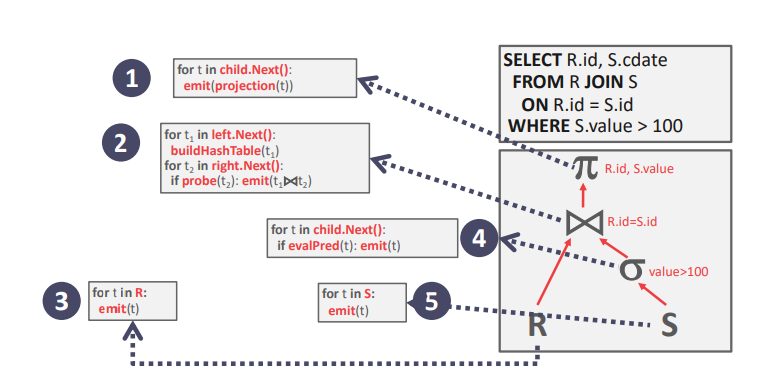
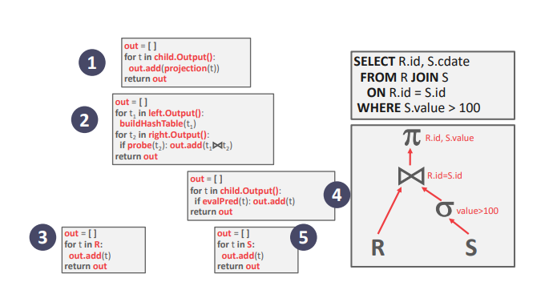
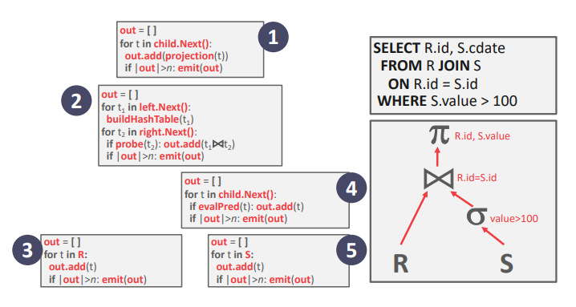
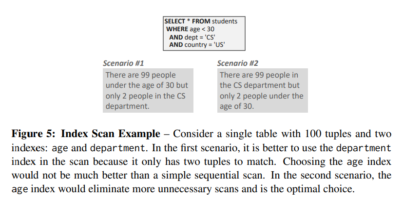
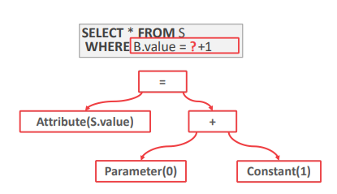

# Lecture 12: Query Execution I

## Agenda

- Processing Models
- Access Methods
- Expression Evaluation

> 在进入正题之前，有必要先了解下什么是 Query Plan. 在 Query plan 中，所有的 operator 都被安排到了树中，数据会从叶子向上流到根结点。根结点的输出就是 query 的输出。比如在如下 SQL 中：
>
> ```SQL
> SELECT R.id, S.cdate
> FROM R JOIN S
> ON R.id = S.id
> WHERE S.value > 100
> ```
>
> 它的 Query Plan 就如下：
>
> 

## Processing Models

DBMS 的 Processing model 定义系统如何执行 query plan. 它规定了比如该从那个方向读 Query Plan 以及 Operators 之间需要传递哪些数据。现在存在有一些不同的 processing models，它们分别应对不同的工作负载，各有权衡。

这些模型可以自上向下，也可自下向上地激发 operator. 尽管自上向下更普遍，但自下向上地方法可以更好地控制流水线中的缓存和寄存器。

### Iterator Model

每个 query plan operator 都要实现 `Next` 函数：

- 每次被调用的时候，这个 operator 都会返回一个 tuple，如果没有 tuple 了，就返回空指针。
- 每个 operator 的实现都是一个循环，循环内调用它子结点的 `Next` 函数来取出 `tuple` 然后处理。

也叫做 **火山模型** 或 **流水线模型**，机会每个 row-based DBMS 中都有用。

> 叫火山模型可能是因为数据从叶子流向根像火山喷发吧。而叫流水线模型，据 Andy 所说，是因为一次只处理一条数据，直到这条数据走完整个过程（要么“喷发”了，要么不符合筛选条件直接下一条了），即流水线，才会处理下一条。
>
> 至于为什么一次处理一条，这是因为硬盘 IO 开销非常大，所以当一条数据进了内存，直到处理完成它才能从内存中出去。

对于本文开头提到的 Query Plan 而言，如果 Processing Model 采用 Iterator Model 的话，示例图如下：



但是有些 operator 却不能一个一个的向上“喷发”，比如说 `join`, 子 query, `order by` 等等。它们必须得等到它们的子结点都“喷发”出来了，它们才能继续向上喷发，因为如果它们的子结点没有“喷发”完，那它的输出是不能决定的。这种 operator 叫做 pipeline breaker.

### Materialization Model

Materialization Model 是 Iterator Model 的特化，它一次处理所有输出，一次“喷发”所有输出。为了避免一次输入太多，DBMS 可以向下传递信息，说它要多少 tuple，然后 operator 就会"物化"它的输出为一个结果。每个 operator 都实现了 `output` 函数：

- operator 会一次性处理从它的子结点拿到的所有输入
- 然后返回所有需要返回的数据。



这种方法比较适合 OLTP[^1] 工作负载，因为一个 query 一般只会访问极少数量的 tuple。不太适合 OLAP[^2] query，因为它们的中间结果太大了，operator 之间的结果会溢出到硬盘。

### Vectorization / Batch Model

与 iterator 模型类似，vectorization 模型也实现了 `next` 函数。然而，每个 operator 一次会“喷发”一批数据，而不是一个。operator 内部的循环实现是对于一次处理一批数据优化过的。批的大小可随硬件或 query 的属性变化。示意图如下：



这个模型对于处理 OLAP query 非常理想，因为 OLAP query 会扫描数量众多的 tuple，而用这个模型调用 `next` 函数的次数会变少。

## Access Methods

Access Methods 是 DBMS 访问存在表中的数据的方法，即上文提到的 query plan 中的 R 和 S 操作符。在关系代数中并未提及。有两种基本方法：要么从索引读数据（index-scan），要么顺序扫描从表中读数据（sequential-scan）。还有一种叫做 multi-index，它是 index-scan 的拓展，允许一次访问多个索引。

### Sequential Scan

迭代表中的每一页，然后从缓冲池中取出它。在迭代的时候，它会验证断言（predicate）是否为真，来决定是否要“喷发”这条数据。

DBMS 需要维护一个内部的指针（internal cursor）记录最后一条验证过的数据的位置。除此之外，还有一些优化可以让顺序扫描更快一些。

- Prefetching：可以提前取一些页，这样 DBMS 就不用在访问每一页的时候都要等了。
- Parallelization：就是多线程/进程并发。
- Buffer Pool Bypass：把页存在局部内存中不是放到缓冲池中，避免污染缓冲池。
- Zone Map：维护对于表中每个 tuple 的各种聚合结果，DBMS 就可以通过先看看 Zone Map 然后决定是否要访问这张表。比如 Zone Map 中说某个字段的最大值为 400，但是 query 要求这个字段要大于 600，那么这张表就可以不用访问了。
- Late Materialization：每个 operator 都只把最少的必要信息传给下一个 operator（如 record id）。这只在 Column-store 的数据库系统中有用。
- Heap Clustering：如果某个索引为聚合索引，则直接按照它的叶节点的顺序扫就可以。

### Index scan

index scan 的目标是确定一种索引，能够避免用户无效操作来快速找到所需数据。要确定这样一个索引，DBMS 需要考虑很多，比如：

- 索引中有什么属性
- query 中需要什么属性
- 属性的值域
- 断言（predicate）的组成，如 `NOT`, `=`, `!=` 等等
- 索引是否为 unique 的键



也有一些高级 DBMS 可以支持 Multi-index scan. 使用 Multi-index scan 的时候，DBMS 会用每个匹配的索引分别计算出 record id 的集合，依据 query 的断言来把它们结合起来（如 `AND` 就要取交集，`OR` 就取并集），最后通过结合后剩下的最后一个来取出所需数据。DBMS 可以用 bitmaps，hash tables 或是 bloom filters 来优化取交集的操作。

## Expression Evaluation

DBMS 将 `where` 语句表示成一棵树，书中各个结点可代表不同类型，如下：



树中结点能存的表达式类型举例：

- 比较：`=`, `<`, `>`, `!=`
- 合取 `AND`，即逻辑与；析取 `OR`，即逻辑或
- 代数算符：`+`, `-`, `*`, `/`, `%`
- 常数和参数
- Tuple Attribute References

为了能够在运行时评估表达式，DBMS会维护一个上下文，包含了本次执行的元数据，比如当前 tuple，参数，以及表的 schema 等等。DBMS 会遍历这棵树来评估各个 operator，然后输出。

这样评估断言太慢了，因为 DBMS 需要遍历整个树。更好的方法是直接评估，像是 JIT。


[^1]: OLTP 为 Online-Transaction-Processing 的缩写，从名字可以看出，主要为了业务 transaction，即需要大量的插入，而查询较少。

[^2]: OLAP 为 Online-Analytical-Processing 的缩写，从名字可以看出，主要为了分析 analytical，即需要大量的查询，而插入较少。
