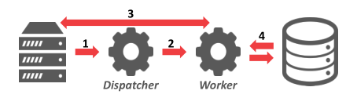
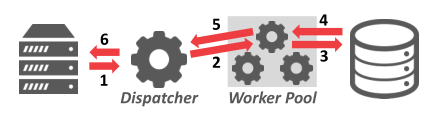
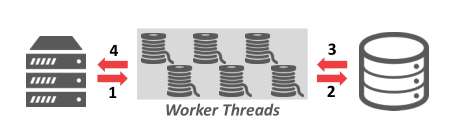
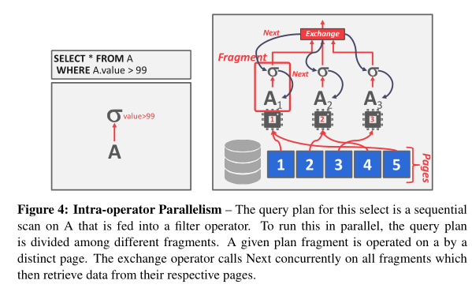
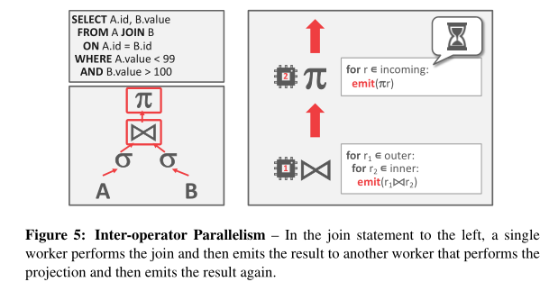
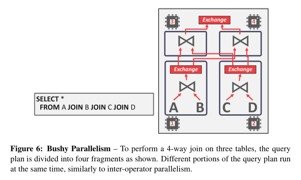

# Lecture 13: Query Execution II

> 本节主要讲的是 Parallelism，即并发。

## Background

之前的所有课程都是假设没有并发时执行的，然而在实践中，数据库常常是并发执行的。并发执行有诸多好处：

- 吞吐量变大，请求执行耗时变少。
- 提高响应性和可用性。
- 可能减少持有损失。包括软硬件购买花费，部署 DBMS 的人力费，以及所需电力消耗。

总体来看，DBMS 支持两种并发：inter-query 和 intra-query 并发。

## Parallel vs Distributed Databases

在并发和分布式系统中，数据库都会分布在不同的“资源”上来提高并发量。这些“资源”要么是计算资源（如 CPU 核心，不同的 CPU，GPU，额外的机器等），要么是存储资源（如硬盘，内存等）。

区别并发和分布式系统很重要，在并发 DBMS 中，上述资源在物理上很接近彼此。它们之间通过高速连接通信，除此之外还很便宜和可靠。

而在分布式数据库中，这些资源都离彼此较远。这意味着资源之间的通信只能通过慢速连接的公共网络。通信速度慢，开销大，而且还不可靠。

即使一个数据库可以被分成很多分，它在应用中还是可以表示成逻辑上一个完整的数据库。因此，对于这些单节点的 DBMS 而言，SQL 请求的结果应该是一样的，不管是使用并行还是分布式。

## Process Models

DBMS process model 定义了系统如何支持来自多用户应用程序/环境的并发请求。DBMS 由多个 workers 组成，这些 workers 代表客户端执行任务并返回结果。应用程序可以同时发送一个大请求或多个请求，这些请求必须在不同的 workers 之间划分。DBMS可以采用三种不同的流程模型：每个 worker 一个进程、进程池，以及每个 worker 一个线程。

### Process per worker

首先是最基础的方法，一个 worker一个线程。每个 worker 进程都是一个独立的 OS 进程，因此依赖于 OS 调度器。App 发送请求并打开与数据库系统的连接，一些 dispatcher 接收到请求，并指派一个 worker 进程来处理此连接。app 现在直接与执行请求的 worker 进程通信，如下图所示。

这就会导致多个 worker 进程会在自己的缓冲池中放数据库同一页的副本，浪费内存。不过也有解决方案，就是让全局数据结构放在共享内存中，让所有进程都能用，这样就不用在每个进程中都存储了。

这种模型的有点在于，如果一个进程崩溃了，它不会让整个系统崩溃。因为每个进程都是 fork 出来的嘛。

### Process Pool

本模型为前一种模型的拓展，即 *进程池*，与之前每一个请求 fork 一个进程不同，workers 是放在一个池子中。每当请求来的时候，dispatcher 就会从池子中选一个进程执行请求。由于池子中的进程是放在一起的，它们可以同时执行请求，或者叫请求并行（query parallelism）。如下图所示：

与前一种模型类似，这种模型也依赖于 OS 调度器和共享内存。缺点是 CPU 缓存局部性差，因为不能保证在不同的查询之间使用相同的进程。

## Thread per worker

最后也是最常见的模型，一个 worker 一个线程。每个 DBMS 只有一个进程，它可以有多个 worker 线程，而不是让不同的进程执行不同的任务。在这种环境下，数据库管理系统完全控制了任务和线程，可以管理自己的调度。这种模型可以也可以不使用 dispatcher，如下图所示。

这种模型有一些有点：① 每个上下文切换的开销更少 ② 不需要维护共享模型。但是，这种模型不支持 intra-query 并行。

> 总结一下，对于每个请求计划（query plan），DBMS 都要决定在哪里、什么时候，以及如何执行。相关问题包括：
>
> - query 应该分成几个任务？
> - 应该用几个 CPU 核心
> - 应该用哪个 CPU 核心
> - 任务输出应该放在哪

当在做和计划有关的决定时，DBMS 永远都会比 OS 知道得更多，因此应该优先考虑。

## Inter-Query Parallelism

在 inter-query 并行中，DBMS 并行执行不同的请求。由于同时有多个 workers 在执行不同的请求，总体性能提高了。这增加了吞吐量并减少了延迟，这里延迟是指执行请求所需要花费的时间。

如果请求是只读的（即只有 `SELECT` 语句），则它们之间并不需要协调。但如果多个请求在并发地更新数据库，则会引发更复杂的冲突。这会在之后的第 16 讲里详细说说。

## Intra-Query Parallelism

在 intra-query 并行中，DBMS 并行执行同一个请求。这会减少需要运行很久的请求的延迟。

我们可以用生产者/消费者模型来考虑 intra-query 并行的结构。每个操作符（operator）都是数据的生产者，同时也是它下面操作符的数据消费者。

每个关系型操作符都有并行算法。DBMS 要么让多线程访问全局数据，要么把活分组让不同的线程干，这样就不用访问全局数据了。

在 intra-query 并行中，有三种并行类型：intra-operator, inter-operator 以及 bushy. 值得注意的是这些方法并不是互斥的，即可以同时采用多种。DBMS 也有责任把这些方法有机结合起来，使之在给定工作负载的情况下，性能达到最优。

### Intra-Operator Parallelism (Horizontal)

在 intra-operator 并行中，请求计划的操作符被分解一些独立的实例，能够在不同的数据子集上运行相同的函数。

DBMS 会在请求计划中插入一些 *exchange* 操作符，用来讲子操作符的输出合并。*exchange* 操作符可以防止它上边的操作符在它收集到所有来自子操作符的数据之前运行。如下图所示：

总体而言，有三种 *exchange* 操作符：

- 收集器 **Gather**：把来自几个 worker 的结果合并成一个输出流。这种是 DBMS 里用的最多的。
- 重分组器 **Repartition**：将多个输入流重新组织成多个输出流。这让 DBMS 可以将输入的数据以一种不同的方式分发出去。比如 `Group by` 就可以用到。
- 分流器：把单一输入流分为多个输出流。

### Inter-Operator Parallelism (Vertical)

在 Inter-operator 并行中，DBMS 会让不同的操作符重叠，为了让数据“流水线式”地从一个阶段到另一个阶段，避免“物化”（materialization，即以某种形式将结果存储起来）。这种并行有时叫做流水线并行，如下图所示：

这种方法常用于流处理系统中，这种系统会持续地在输入流上执行一个请求。

### Bushy Parallelism

*Bushy Parallelism* 是 inter-operator 并行的一种拓展，它的 workers 会同时执行请求计划中不同部分的多个操作符。

DBMS 仍然要使用 *exchange* 操作符来把不同部分的中间结果结合起来，如下图所示：

## IO Parallelism

如果硬盘是主要瓶颈的话，使用额外的进程或线程执行请求并不会有多大改观。这种情况下，把数据库分成几份存在多个设备上非常有用。三种 IO 并行的方法为多硬盘并行，数据库分区以及逻辑分区。

### Multi-Disk Parallelism

多硬盘并行中，OS 或硬件被配置成可以在多设备上存储 DBMS 的文件，这可以通过存储应用和 RAID 配置完成。所有的存储设置对于 DBMS 而言都是透明的，这样 workers 就不能在不同设备上操作，因为 DBMS 没有意识到底层的并行性。

### Database Partitioning

在数据库中分组，数据库被分成互不相关的子集，分别存在不同的硬盘上。

### Logical Partitioning

在逻辑分组中，逻辑上的一张表会被分成物理上互不相关部分，并在不同位置存储。这种分组对应用而言是透明的，即应用使用数据库的时候并不知道它们被分开了。有两种方法

- 水平分组：表中数据被分成几个部分，每个 tuple 都是完整的存在一起，但是不同 tuple 可能存放位置不一样。
- 竖直分组：像是列式存储，不同的列可能存放在不同的地方。

